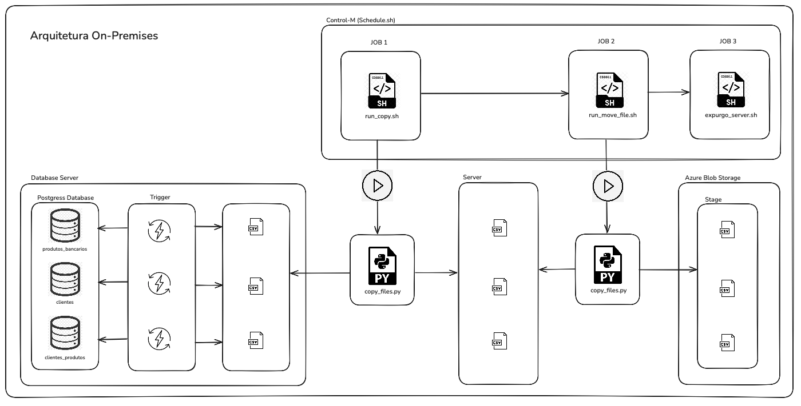

# Data Master

Case de apresentação Data Master.

## Índice

1. [Descrição](#descrição)
2. [Explicação dos Arquivos](#explicação-dos-arquivos)
3. [Arquivos de Configuração](#arquivos-de-configuração)
3. [Como Executar](#como-executar)

## Descrição

Esta etapa do projeto consiste em ler os dados de origem, que estão em um banco de dados PostgreSQL. 
Por meio de uma procedure, os dados são gerados em um arquivo .csv. Em seguida, esses dados são enviados para um 
blob storage de estágio dentro do Azure Blob Storage.

## Explicação dos Arquivos

### `postgres/`

- **01_create_table.sql**: Script SQL para a criação das tabelas `produtos_bancarios`, `clientes`, e `clientes_produtos`.
- **02_triggers_to_cloud.sql**: Script SQL para criação das triggers associadas às tabelas.
- **03_clientes.sql**: Script de `INSERT` para a população de dados na tabela `clientes`.
- **04_clientes_produtos.sql**: Script de `INSERT` para popular a tabela de relacionamento `clientes_produtos`.
- **05_produtos.sql**: Script de `INSERT` para a tabela `produtos`.
- **Dockerfile**: Arquivo para configurar e criar o container Docker com o PostgreSQL e scripts associados.

### `transfer/`

- **copy_files.py**: Script Python para copiar arquivos de origem para o destino.
- **Dockerfile**: Arquivo para criar o container que executa o processo de transferência de dados.
- **entrypoint.sh**: Script de entrada para o container que inicializa o processo.
- **requirements.txt**: Lista de dependências necessárias para o projeto Python.
- **run_copy.sh**: Script para executar o processo de cópia de arquivos.
- **run_move_file.sh**: Script para mover arquivos para outros diretórios.
- **schedule.sh**: Script para agendamento de tarefas no container.
- **transfer.py**: Script principal que gerencia a transferência de dados para o Azure Blob Storage.
- **expurgo_server.sh**: Script responsável por limpar os dados coletados do servidor do postgres

### Arquivos de Configuração

- **docker-compose.yaml**: Arquivo que configura os serviços do Docker, incluindo os containers do PostgreSQL e do processo de transferência.
- **Makefile**: Arquivo para automação de tarefas, simplificando a execução de comandos como `docker-compose up` e outros.
- **readme.md**: Este arquivo com a documentação do projeto.

### Como Executar

1. **Clone o repositório**:
   - Clone o repositório com o comando `git clone <url-do-repositorio>`.

2. **Configuração do Ambiente**:
   - Certifique-se de ter o Docker e Docker Compose instalados.

3. **Subir os Containers**:
   - Execute `make` para subir todos os containers necessários.
   - Execute `make down` para deletar todos os containers necessários.
   - Execute `image prune -a` para limpar as imagens criadas no Docker.

4. **Transferir os Dados**:
   - O processo de transferência inicia a partir do arquivo schedule.sh, que foi utilizado para simular os jobs control-m, que deve ser utilizado nesta parte do projeto.
        - JOB 1 - Inicia o arquivo ./run_copy.sh que é responsável por copiar os dados gerados da trigger no server do postgress.
        - JOB 2 - Inicia o arquivo ./run_move_file.sh que é responsável por enviar os arquivos para o Blob Storage da Azure.
        - JOB 3 - Inicia o arquivo ./expurgo.sh  que é responsável por deletar os arquivos já enviados da pasta.

